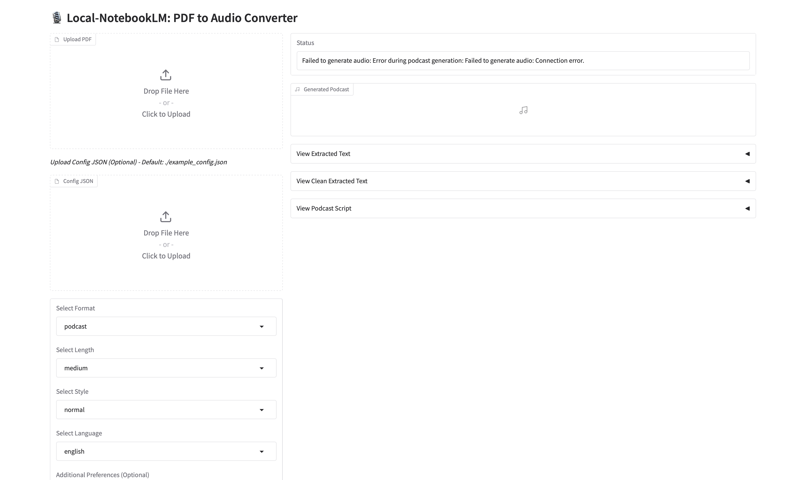
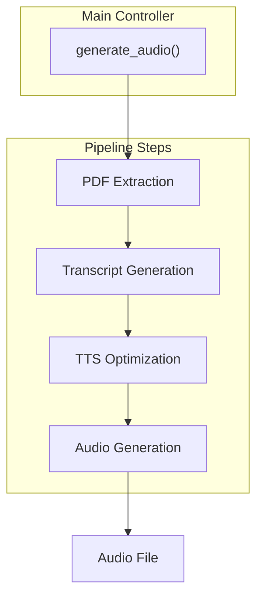

# Local-NotebookLM


A local AI-powered tool that converts PDF documents into engaging audio—such as podcasts or custom audio content—using local LLMs and TTS models.

## Features

- PDF text extraction and processing
- Customizable audio generation (podcasts, summaries, interviews, and more) with different styles and lengths
- Support for various LLM providers (OpenAI, Groq, LMStudio, Ollama, Azure)
- Text-to-Speech conversion with voice selection
- Flexible pipeline with many options for content, style, and voices
- Programmatic API for integration in other projects
- FastAPI server for web-based access
- Example podcast included for demonstration

#### Here is a quick example, can you guess what paper they're talking about?

<audio controls>
  <source src="./examples/podcast.wav" type="audio/mpeg">
  Your browser does not support the audio element. You can manualy download the file here './examples/podcast.wav'.
</audio>

## Prerequisites

- Python 3.9+
- Local LLM server (optional, for local inference)
- Local TTS server (optional, for local audio generation)
- At least 8GB RAM (16GB+ recommended for local models)
- 10GB+ free disk space

## Installation

### From PyPI

```bash
pip install local-notebooklm
```

### From source

1. Clone the repository:

```bash
git clone https://github.com/Goekdeniz-Guelmez/Local-NotebookLM.git
cd Local-NotebookLM
```

2. Create and activate a virtual environment (conda works too):

```bash
python -m venv venv
source venv/bin/activate  # On Windows, use: venv\Scripts\activate
```

3. Install the required packages:

```bash
pip install -r requirements.txt
```

## Running with Docker

You can run Local-NotebookLM using Docker for both the Web UI and API modes.

### Prerequisites

- Docker installed on your system

### Steps

1. **Build the Docker image:**

    ```bash
    docker build -t local-notebooklm-ui .
    ```

2. **Run the Gradio Web UI:**

    ```bash
    docker run -p 7860:7860 local-notebooklm-ui
    ```
    The Web UI will be available at [http://localhost:7860](http://localhost:7860).

3. **Run the FastAPI API server:**

    ```bash
    docker run -e APP_MODE=api -p 8000:8000 local-notebooklm-ui
    ```
    The API server will be available at [http://localhost:8000](http://localhost:8000).
## Optional pre requisites
### Local TTS server
- Follow one installation type (docker, docker-compose, uv) at https://github.com/remsky/Kokoro-FastAPI
- Test in your browser that http://localhost:8880/v1 return the json: {"detail":"Not Found"}
  
## Example Output

The repository includes an example podcast in `examples/podcast.wav` to demonstrate the quality and format of the output. The models used are: gpt4o and Mini with tts-hs on Azure. You can listen to this example to get a sense of what Local-NotebookLM can produce before running it on your own PDFs.


## Usage

### Command Line Interface

Run the script with the following command:

```bash
python -m local_notebooklm.make_audio --pdf PATH_TO_PDF [options]
```

#### Available Options

| Option | Description | Default |
|--------|-------------|---------|
| `--pdf` | Path to the PDF file (required) | - |
| `--output_dir` | Directory to store output files | ./output |
| `--llm_model` | Ollama LLM model name | qwen3:30b-a3b-instruct-2507-q4_K_M |
| `--language` | Language for the audio output | english |
| `--format_type` | Output format type (summary, podcast, article, interview, panel-discussion, debate, narration, storytelling, explainer, lecture, tutorial, q-and-a, news-report, executive-brief, meeting, analysis) | podcast |
| `--style` | Content style (normal, casual, formal, technical, academic, friendly, gen-z, funny) | normal |
| `--length` | Content length (short, medium, long, very-long) | medium |
| `--num_speakers` | Number of speakers in audio (1, 2, 3, 4, 5) | 2 (for podcast/interview) |
| `--custom_preferences` | Additional focus preferences or instructions | None |

#### Format Types

Local-NotebookLM supports both single-speaker and multi-speaker formats:

**Single-Speaker Formats:**
- summary
- narration
- storytelling
- explainer
- lecture
- tutorial
- news-report
- executive-brief
- analysis

**Two-Speaker Formats:**
- podcast
- interview
- panel-discussion
- debate
- q-and-a
- meeting

**Multi-Speaker Formats:**
- panel-discussion (3, 4, or 5 speakers)
- debate (3, 4, or 5 speakers)

#### Example Commands

Basic usage:
```bash
python -m local_notebooklm.make_audio --pdf documents/research_paper.pdf
```

Customized podcast:
```bash
python -m local_notebooklm.make_audio --pdf documents/research_paper.pdf --format_type podcast --length long --style casual
```

With custom preferences:
```bash
python -m local_notebooklm.make_audio --pdf documents/research_paper.pdf --custom_preferences "Focus on practical applications and real-world examples"
```

Specify number of speakers:
```bash
python -m local_notebooklm.make_audio --pdf documents/research_paper.pdf --format_type panel-discussion --num_speakers 3
```

### Programmatic API

You can also use Local-NotebookLM programmatically in your Python code:

```python
from local_notebooklm.processor import generate_audio

generate_audio(
    pdf_path="documents/research_paper.pdf",
    output_dir="./test_output",
    llm_model="qwen3:30b-a3b-instruct-2507-q4_K_M",
    language="english",
    format_type="interview",
    style="professional",
    length="long",
    num_speakers=2,
    custom_preferences="Focus on the key technical aspects"
)
```

### Gradio Web UI

Local-NotebookLM now includes a user-friendly Gradio web interface that makes it easy to use the tool without command line knowledge:

```bash
python -m local_notebooklm.web_ui
```

By default, the web UI runs locally on http://localhost:7860. You can access it from your browser.

#### Web UI Screenshots


*The main interface of the Local-NotebookLM web UI*

#### Web UI Options

| Option | Description | Default |
|--------|-------------|---------|
| `--share` | Make the UI accessible over the network | False |
| `--port` | Specify a custom port | 7860 |

#### Example Commands

Basic local usage:
```bash
python -m local_notebooklm.web_ui
```

Share with others on your network:
```bash
python -m local_notebooklm.web_ui --share
```

Use a custom port:
```bash
python -m local_notebooklm.web_ui --port 8080
```

The web interface provides all the same options as the command line tool in an intuitive UI, making it easier for non-technical users to generate audio content from PDFs.

### FastAPI Server

Start the FastAPI server to access the functionality via a web API:

```bash
 python -m local_notebooklm.server
```

By default, the server runs on http://localhost:8000. You can access the API documentation at http://localhost:8000/docs.

## Pipeline Steps

1. **PDF Extraction**
   - Extracts and cleans text from the provided PDF.
2. **Transcript Generation**
   - Generates a transcript or script based on the extracted content and user options.
3. **Audio Generation**
   - Converts the optimized transcript to audio using the specified TTS model and outputs the final audio file.

### Pipeline Diagram



## Multiple Language Support

Local-NotebookLM now supports multiple languages. You can specify the language when using the programmatic API or through the command line.

**Important Note:** When using a non-English language, ensure that both your selected LLM and TTS models support the desired language. Language support varies significantly between different models and providers. For optimal results, verify that your chosen models have strong capabilities in your target language before processing.


## Output Files

The pipeline generates the following files:

- `segments/podcast_segment_*.wav`: Individual audio segments
- `podcast.wav`: Final concatenated podcast audio file

## Troubleshooting

### Common Issues

1. **PDF Extraction Fails**
   - Try a different PDF file
   - Check if the PDF is password-protected
   - Ensure the PDF contains extractable text (not just images)

2. **API Connection Errors**
   - Verify your API keys are correct
   - Check your internet connection
   - Ensure the API endpoints are accessible

3. **Out of Memory Errors**
   - Reduce the chunk size in the configuration
   - Use a smaller model
   - Close other memory-intensive applications

4. **Audio Quality Issues**
   - Try different TTS voices
   - Adjust the sample rate in the configuration
   - Check if the TTS server is running correctly

### Getting Help

If you encounter issues not covered here, please:
1. Check the logs for detailed error messages
2. Open an issue on the GitHub repository with details about your problem
3. Include the error message and steps to reproduce the issue

## Requirements

- Python 3.9+
- PyPDF2
- tqdm
- numpy
- soundfile
- requests
- pathlib
- fastapi
- uvicorn

Full requirements are listed in `requirements.txt`.

## Acknowledgments

- This project uses various open-source libraries and models
- Special thanks to the developers of LLaMA, OpenAI, and other AI models that make this possible

---

For more information, visit the [GitHub repository](https://github.com/Goekdeniz-Guelmez/Local-NotebookLM).

Best
Gökdeniz Gülmez

---

## Citing Local-NotebookLM

The Local-NotebookLM software suite was developed by Gökdeniz Gülmez. If you find Local-NotebookLM useful in your research and wish to cite it, please use the following
BibTex entry:

```text
@software{
  Local-NotebookLM,
  author = {Gökdeniz Gülmez},
  title = {{Local-NotebookLM}: A Local-NotebookLM to convert PDFs into Audio.},
  url = {https://github.com/Goekdeniz-Guelmez/Local-NotebookLM},
  version = {0.1.5},
  year = {2025},
}
```
